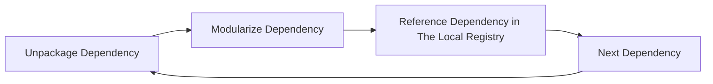
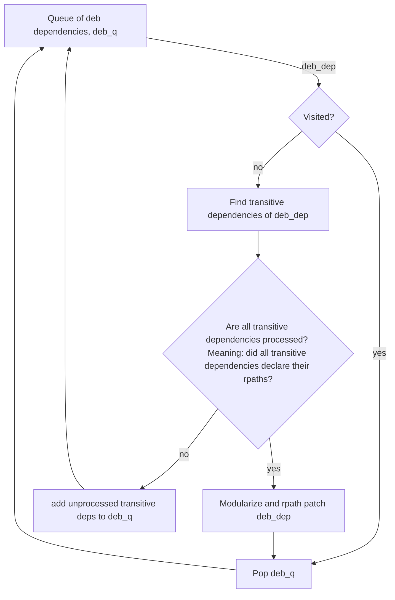
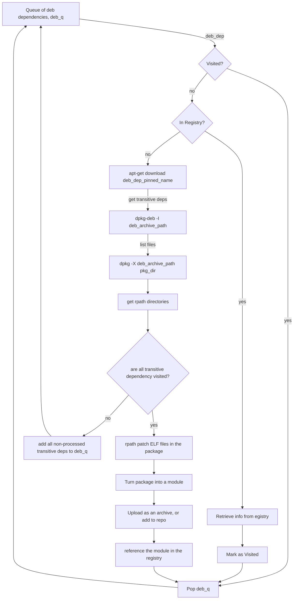

# dependency-bazelizer (WIP)

The dependency bazelizer takes an input list debian packages, and turns them and their entire transitive dependency subgraphs into ready-to-use, fully bazelizer modules (bzlmods). It also automatically references the bazelized modules in the internal registry of the repo. A demo of how this looks like can be found at: https://www.youtube.com/watch?v=LFV-H7djEYw

So far, the dependency-bazelizer supports debian packages only. The plan is to include Python as well in the following versions.

# Summary

Up until `Bazel 5`, Bazel had not been able to resolve dependency graphs. The result was that `Bazel` needed a dependency manager to run during **every build** to build the transitive dependency graph of each dependency. Since this process needs to run early in the build, repository rules for package managers started being developed and became the norm.

Since `Bazel 6` and the introduction of `bzlmods`, modules can tell bazel what transitive dependencies they need exactly. `Bazel` then builds a unique transitive dependency subgraph for each module. In other words, Bazel can act like a package manager. This opened a door to a different approach of handling the external dependency management problem.

### What if every dependency was a bzlmod?

Imagine every debian dependency, every python dependency ... etc has suddenly become a bazel module. What would happen? 

* Package managers running as repository rules would no longer be needed. Meaning that dependencies wouldn't need to be installed over and over again in the early stages of each uncached build => more efficient builds.

* Bazel would build a strict dependency subgraph for each dependency, and even provide a lock file representing these subgraphs =>Easier and more reliable Software Bill Of Material (SBOM) for the modules.

### How can we make that happen?

Modules act cool, but in reality, they are anything with a `MODULE.bazel` file on top, and a few accessory files like an empty `WORKSPACE` and a `BUILD.bazel` file exposing the files and targets to be used by other modules. 

So in order to turn a debian package, say `deb_a`, into a module, all we need to do is: unpackage it, put a `MODULE.bazel`, empty `WORKSPACE` and a `BUILD.bazel` file on top, and store the folder containing everything somewhere in the repo (or archive it and upload it somewhere).

Great, so now `deb_a` is a module. Problem is, it is likely that `deb_a` has transitive dependencies. In order for the `deb_a` module to fetch those dependencies, they also need to be modules. In other words, the entire subgraph needs to be built up of bazel modules. This means that the modularization process mentioned above should be done for the entire dependency subgraph.

The dependency-bazelizer tries to do exactly that; it processes the entire dependency graph and repackages it into modules. It also adds references to these modules in a local registry inside the repo. One can visualize the process as in the graph below

Since it is not necessary for this tool to be implemented as a repository rule, I decided to do it entirely in python. This could make the code base easier to test and collaborate on.

# Give it a try!

### Requirements

In order to try the dependency-bazelizer, you need a linux distribution that has `apt`, `dpkg` and `patchelf` installed. The reason `patchelf` was not bazelized is that I don't know where this script will run (ubuntu, wsl ... etc). In case you are interested in bazelizing the `patchelf` dependency, you can easily do that using the dependency-bazelizer itself on your chosen platform. You are recommended to have [bazelisk](https://github.com/bazelbuild/bazelisk) installed as well.

* clone the repo.
* `cd dependency-bazelizer`
* fill up the deb_packages.in file with the deb packages you want to modularize. Name and architecture of the package are mandatory, and the package needs to follow the format: `name:arch=version`
* `bazelisk run //src:dependency-bazelizer`

Now you have will have the dependencies, listed in the deb_packages.in, modularized, alongside their entire transitive dependency graphs! :partying_face:

The `dependency-bazelizer` locate the new modules in the folder `modules/`. If you navigate there and run `ldd` on any ELF file in the `modules/` dir, you should be able to see that the ELF file accesses its runtime deps from the modules not the system:

Since the file structure and naming matches that in the runfiles, you can expect the same results once you run a program.

The `dependency-bazelizer` also adds an internal registry referencing those modules at `registry/`. In the .bazelrc, I already added the internal registry as the main bazel registry, with the Bazel Central Registry as a fallback. So as soon as you modularize the desired dependencies, you can go ahead and play around with them!

If this is the first time you play around with this tool, this video will help you get started: 
https://www.youtube.com/watch?v=LFV-H7djEYw

# Nerdy details

The work is not done by adding a `MODULE.bazel` to a package and making sure that this module fetches the needed transitive dependencies. The pre-compiled C/C++ files in a package don't only expect their transitive runtime dependencies to exist on the system, but also to exist in a specific predefined location (`/bin/` for example). However, we don't want the transitive dependencies to be accessed directly from the system, we want the transitive deps in the runfiles to be the ones used ! This makes the problem way more exciting :wink:

### RPath patching

The problem above has a solution: RPaths! Rpaths are both searched before `LD_LIBRARY_PATH` (they take priority over `LD_LIBRARY_PATH`s) and they can be patched after the library has already been compiled. The RPath patching can be acheived using tools like patchelf, which is the tool we are using here. For more info: https://www.qt.io/blog/2011/10/28/rpath-and-runpath

But how does a dependency know the `rpath` of its transitive runtime deps ? 

I will answer this with an art work:

So basically dependency B needs to be processed ahead of dependency A. It also needs to self declare all the parent directories of all the ELF files in it. In other words, the dependency graph needs to be processed in a **topological order**.

### Code Workflow - Debian Only

Now in the case of debian packages, the implementation details mentioned above can be translated into the following workflow:

A more detailed view would look like:

