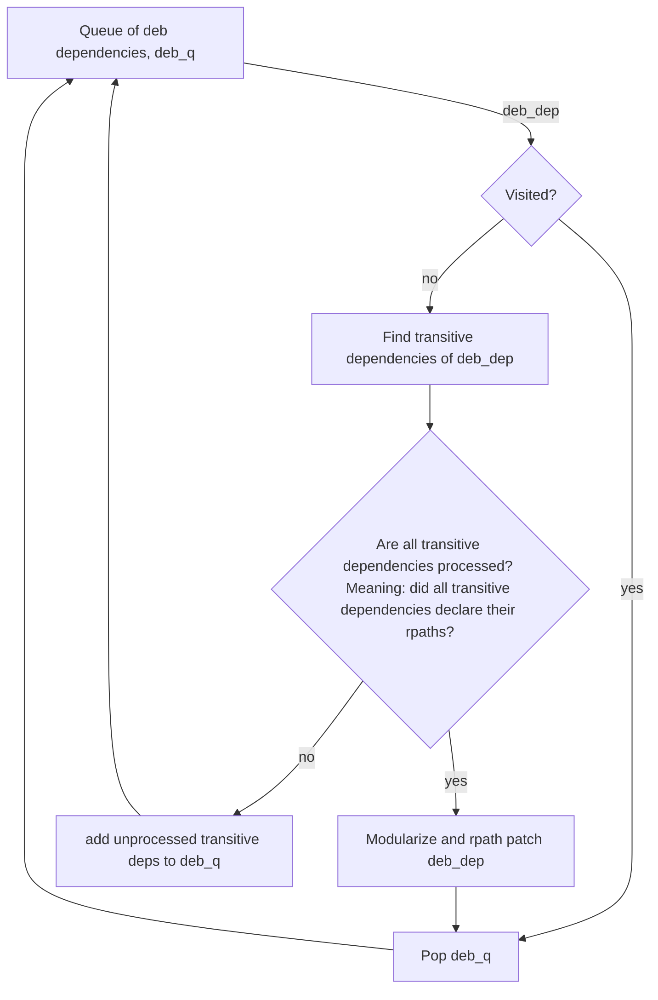
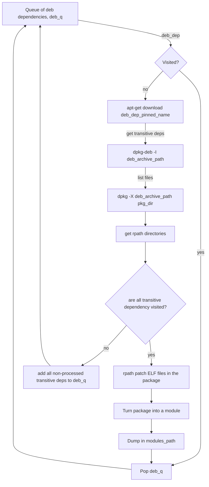

[](https://github.com/shabanzd/debian_dependency_bazelizer/actions)
[](https://github.com/shabanzd/debian_dependency_bazelizer/blob/main/LICENSE)

# debian_dependency_bazelizer

The `debian_dependency_bazelizer` takes an input list of debian packages, and turns them and their entire transitive dependency subgraphs into ready-to-use, fully bazelized modules (bzlmods).

## Getting started

### Requirements

In order to try the `debian_dependency_bazelizer`, you need a linux distribution running `apt` and `dpkg`. These are needed to manage and unpack the debian packages. In addition, `patchelf` needs to be installed (preferably version 0.10).

### Using the debian_dependency_bazelizer

In order to use the `debian_dependency_bazelizer`, please apply the following steps:

* In the `MODULE.bazel`, add:

```
bazel_dep(name = "debian_dependency_bazelizer", version = "0.0.1")
```

* call `bazel run @debian_dependency_bazelizer --`

The `debian_dependency_bazelizer` takes the following arguments:

### Input file

The input file is the file containing the debian packages to be turned into bzlmods. Similar to:

```
# The input deb package needs to follow the template: 
# name:arch=version. Where name and arch are mandatory, and version is optional.
deb_package1:amd64=1.2.3
deb_package2:amd64=1.2.3
```

### Modules path

The path to which the modules are dumped. It is up to the user to decide where to upload them and how to access them.

An example usage can be found at: https://github.com/shabanzd/debian_dependency_bazelizer/tree/main/example

## Summary

Up until `Bazel 5`, Bazel had not been able to resolve dependency graphs. As a result, Bazel needed a dependency manager to run during every build to build the transitive dependency graph of each dependency. Since this process needed to run early in the build, repository rules for package managers were developed and became the norm.

Since `Bazel 6` and the introduction of `bzlmod`s, the approach described above is no longer the only option.

The `debian_dependency_bazelizer` is a tool that takes input packages of different types, then turns those packages, in addition to their entire dependency graphs, into `bzlmod`s. The created modules by the `debian_dependency_bazelizer` access their transitive runtime dependencies directly from the runfiles; not from sysroot or a custom sysroot.

### What if every dependency was a bzlmod?

Imagine every debian dependency, every python dependency ... etc has suddenly become a bazel module. What would happen?

* Package managers running as repository rules would no longer be needed. Meaning that dependencies wouldn't need to be installed over and over again in the early stages of each uncached build => more efficient builds.

* Bazel will be aware of all the versions being resolved => a more reliable and resilient bazel cache.

* Bazel would build a strict dependency subgraph for each dependency, and even provide a lock file representing these subgraphs => Easier and more reliable Software Bill Of Material (SBOM) for the modules.

* The input to actions are now `bzlmod`s representing individual dependencies, and not a third-party-package-manager lock file representing the entire dependency graph as one input. This allows for a more granual builds.

### How can we make that happen?

`Bzlmod` act cool, but in reality, they are anything with a `MODULE.bazel` file on top, and a few accessory files like an empty `WORKSPACE` and a `BUILD.bazel` file exposing the files and targets to be used by other modules.

So in order to turn a debian package, say `deb_a`, into a module, all we need to do is: unpackage it, put a `MODULE.bazel`, empty `WORKSPACE` and a `BUILD.bazel` file on top, and store the folder containing everything somewhere in the repo (or archive it and upload it somewhere).

Great, so now `deb_a` is a module. Problem is, it is likely that `deb_a` has transitive dependencies. In order for the `deb_a` module to fetch those dependencies, they also need to be modules. In other words, the entire subgraph needs to be built up of bazel modules. This means that the modularization process mentioned above should be done for the entire dependency subgraph.

The `debian_dependency_bazelizer` tries to do exactly that; it processes the entire dependency graph and repackages it into modules. One can visualize the process as in the graph below


Since it is not necessary for this tool to be implemented as a repository rule, I decided to do it entirely in python. This could make the code base easier to test and collaborate on.

## Nerdy details / Contributor zone

The work is not done by adding a `MODULE.bazel` to a package and making sure that this module fetches the needed transitive dependencies. The pre-compiled C/C++ files in a package don't only expect their transitive runtime dependencies to exist on the system, but also to exist in a specific predefined location (`/bin/` for example). However, we don't want the transitive dependencies to be accessed directly from the system, we want the transitive deps in the runfiles to be the ones used ! This makes the problem way more exciting :wink:

### RPath patching

The problem above has a solution: RPaths! Rpaths are both searched before `LD_LIBRARY_PATH` (they take priority over `LD_LIBRARY_PATH`s) and they can be patched after the library has already been compiled. The RPath patching can be acheived using tools like patchelf, which is the tool we are using here. For more info: <https://www.qt.io/blog/2011/10/28/rpath-and-runpath>

But how does a dependency know the `rpath` of its transitive runtime deps ?

I will answer this with an art work :art: :


So basically dependency B needs to be processed ahead of dependency A. It also needs to self-declare all the parent directories of all the ELF files in it. In other words, the dependency graph needs to be processed in a **topological order**.

### Code Workflow - Debian Only

Now in the case of debian packages, the implementation details mentioned above can be translated into the following workflow:



A more detailed view would look like:


